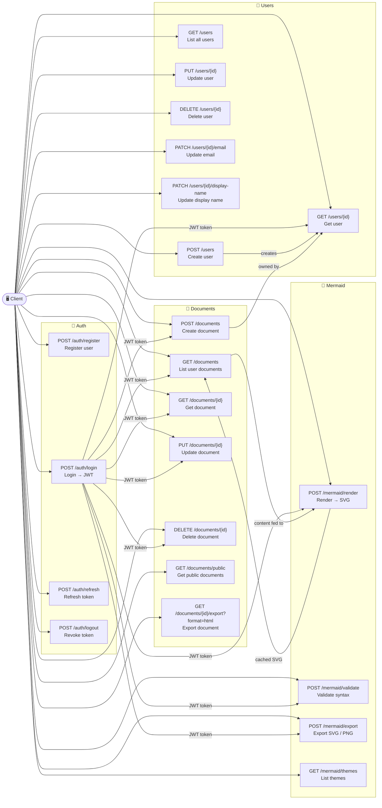

# MermaidFlow

A .NET backend for creating, managing, and rendering Mermaid diagram documents. Write Markdown with embedded Mermaid diagrams — MermaidFlow handles storage, server-side rendering, and export.

---

## Tech Stack

| Layer          | Technology                           |
| -------------- | ------------------------------------ |
| Framework      | ASP.NET Core 10 (Web API)            |
| Architecture   | Clean Architecture + CQRS (MediatR)  |
| ORM            | Entity Framework Core 9 (SQL Server) |
| Authentication | JWT Bearer                           |
| Rendering      | Playwright (headless Chromium)       |
| Validation     | FluentValidation                     |
| API Docs       | Scalar (OpenAPI)                     |

---

## Project Structure

```
src/
├── MermaidFlow.Api/            # Controllers, Program.cs
├── MermaidFlow.Application/    # CQRS commands/queries, interfaces
├── MermaidFlow.Domain/         # Entities (no dependencies)
├── MermaidFlow.Infrastructure/ # EF Core, repositories, services
└── MermaidFlow.Contracts/      # Request/response DTOs
```

---

## API Endpoints



---

## Implemented Features

### Authentication & Authorization

- JWT Bearer token authentication with refresh token flow
- PBKDF2 password hashing (SHA256, 100k iterations)
- Token revocation on logout
- Role-based authorization policies

### Mermaid Rendering

- Server-side rendering using Playwright (headless Chromium)
- Support for both `application/json` and `text/plain` content types
- SVG output with theme support
- Syntax validation endpoint

### Diagram Caching

- SHA-256 hash-based caching of rendered SVGs
- Configurable cache expiration
- Reduces server load for repeated renders

### Document Management

- Full CRUD operations for documents
- Public/private document visibility
- Document ownership and access control

### API Features

- OpenAPI documentation via Scalar
- FluentValidation request/response validation
- ErrorOr pattern for consistent error responses

---

## Getting Started

### Prerequisites

- [.NET 10 SDK](https://dotnet.microsoft.com/download)
- SQL Server or LocalDB

### Run

```bash
# Apply database migrations
dotnet ef database update --project src/MermaidFlow.Infrastructure --startup-project src/MermaidFlow.Api

# Start the API
dotnet run --project src/MermaidFlow.Api --urls "http://localhost:5209"
```

## Data Models

### `Document`

```
- Id (Guid)
- Title (string, required, max 200)
- Content (string, required)  // Raw markdown
- UserId (Guid, FK)
- CreatedAt (DateTime)
- UpdatedAt (DateTime)
- IsPublic (bool)
- Tags (List<string>)
```

### `User`

```
- Id (Guid)
- Email (string, unique)
- PasswordHash (string)
- DisplayName (string)
- CreatedAt (DateTime)
```

### `DiagramCache`

```
- Id (Guid)
- MermaidHash (string, indexed)  // SHA256 of mermaid code
- RenderedSvg (string)           // Cached SVG output
- Theme (string)
- CreatedAt (DateTime)
- ExpiresAt (DateTime)
```

---

## Roadmap

- [x] JWT authentication
- [x] Server-side Mermaid rendering (Playwright)
- [x] Diagram caching (SHA-256 hash → SVG cache)
- [x] Document export (HTML)
- [x] FluentValidation pipeline
- [x] Unit & integration tests (xUnit + Moq)
- [ ] Real-time preview (SignalR)
