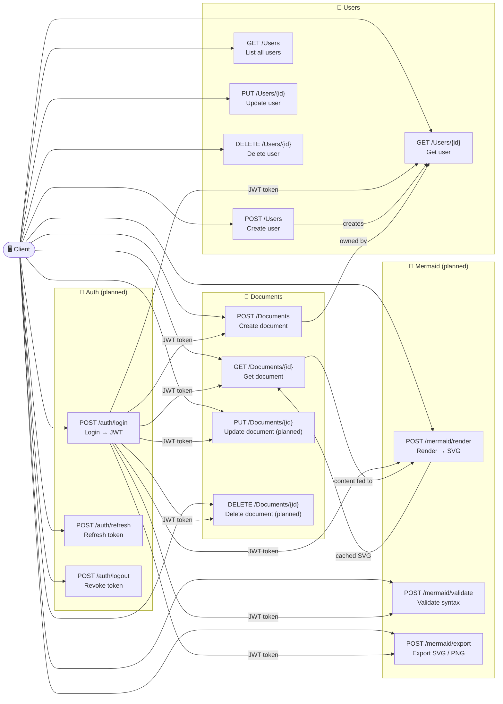

# MermaidFlow

A .NET backend for creating, managing, and rendering Mermaid diagram documents. Write Markdown with embedded Mermaid diagrams — MermaidFlow handles storage, server-side rendering, and export.

---

## Tech Stack

| Layer          | Technology                              |
| -------------- | --------------------------------------- |
| Framework      | ASP.NET Core 10 (Web API)               |
| Architecture   | Clean Architecture + CQRS (MediatR)     |
| ORM            | Entity Framework Core 9 (SQL Server)    |
| Authentication | JWT Bearer*(planned)*                   |
| Rendering      | PuppeteerSharp / Mermaid CLI*(planned)* |
| Validation     | FluentValidation*(planned)*             |
| API Docs       | Scalar (OpenAPI)                        |

---

## Project Structure

```
src/
├── MermaidFlow.Api/            # Controllers, Program.cs
├── MermaidFlow.Application/    # CQRS commands/queries, interfaces
├── MermaidFlow.Domain/         # Entities (no dependencies)
├── MermaidFlow.Infrastructure/ # EF Core, repositories, services
└── MermaidFlow.Contracts/      # Request/response DTOs
```

---

## API Endpoints



---

## Getting Started

### Prerequisites

- [.NET 10 SDK](https://dotnet.microsoft.com/download)
- SQL Server or LocalDB

### Run

```bash
# Apply database migrations
dotnet ef database update --project src/MermaidFlow.Infrastructure --startup-project src/MermaidFlow.Api

# Start the API
dotnet run --project src/MermaidFlow.Api --urls "http://localhost:5209"
```

## Data Models

### `Document`

```
- Id (Guid)
- Title (string, required, max 200)
- Content (string, required)  // Raw markdown
- UserId (Guid, FK)
- CreatedAt (DateTime)
- UpdatedAt (DateTime)
- IsPublic (bool)
- Tags (List<string>)
```

### `User`

```
- Id (Guid)
- Email (string, unique)
- PasswordHash (string)
- DisplayName (string)
- CreatedAt (DateTime)
```

### `DiagramCache`

```
- Id (Guid)
- MermaidHash (string, indexed)  // SHA256 of mermaid code
- RenderedSvg (string)           // Cached SVG output
- Theme (string)
- CreatedAt (DateTime)
- ExpiresAt (DateTime)
```

---

## Roadmap

- [ ] JWT authentication
- [ ] Server-side Mermaid rendering (PuppeteerSharp)
- [ ] Diagram caching (SHA-256 hash → SVG cache)
- [ ] Document export (HTML / PDF via QuestPDF)
- [ ] FluentValidation pipeline
- [ ] Rate limiting on render endpoint
- [ ] Unit & integration tests (xUnit + Moq)
